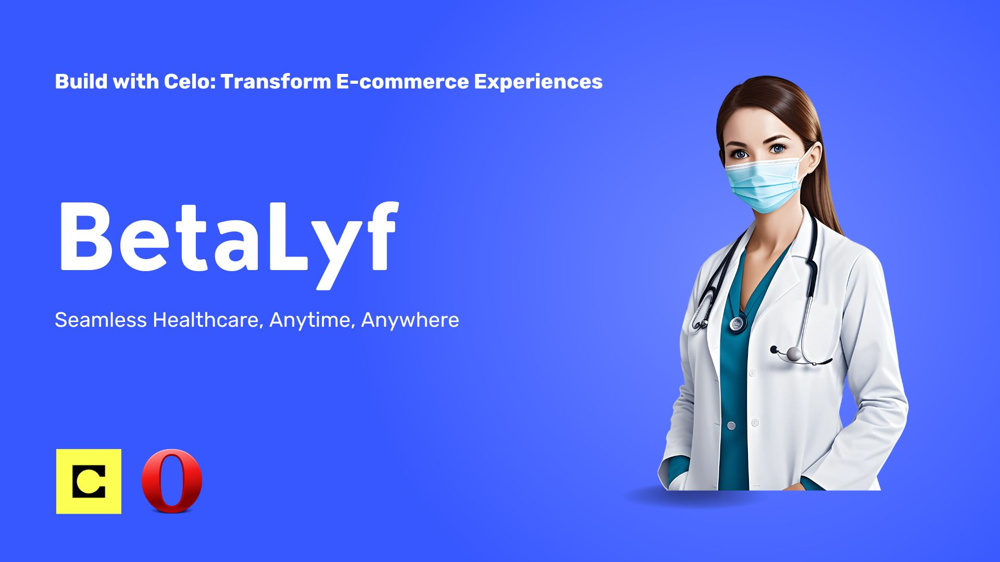

# BetaLyf

This project is for the Build With Celo 6, [Minipay Hackathon](https://build-with-celo-6.hackerearth.com/)

## Short Description

Introducing BetaLyf: Seamless healthcare at your fingertips! Access online consultations and purchase vital medical products from home. Experience the future of healthcare with BetaLyf. Your well-being, our priority. 

## Description

Introducing BetaLyf, your gateway to seamless healthcare at your fingertips. Imagine a world where online consultations are just a tap away, connecting you to top medical professionals from the comfort of your home. With BetaLyf, you can also easily purchase vital medical products, from essential multivitamins to specialized tools for managing conditions like hypertension and diabetes. Experience the future of healthcare with BetaLyf, where your well-being is our priority.

## Problem

- Limited Access to Healthcare: Many individuals struggle to access healthcare services due to geographical barriers or a lack of nearby medical facilities.

- Time Constraints: Busy schedules and long wait times at clinics prevent people from getting timely medical consultations and care.

- Management of Chronic Conditions: Patients with chronic conditions such as hypertension and diabetes often lack the tools and consistent support needed to effectively manage their health.

- Availability of Medical Products: Obtaining essential medical products and supplements can be challenging, especially in remote or underserved areas.

- High Costs: Healthcare services and medical products are often expensive, creating financial barriers for many people in need of care.

- Lack of Personalized Care: Traditional healthcare systems may not always provide personalized care and recommendations tailored to individual health needs.

- Inconvenience of In-Person Visits: The necessity of in-person visits for consultations and prescriptions can be inconvenient and sometimes impossible for those with mobility issues or busy lives.

- Fragmented Healthcare Experience: Managing health can feel disjointed when services and products are spread across multiple providers and locations, leading to inefficiencies and gaps in care.

## Solution

- Making accessibility to healthcare even easier. One can book a physician for any time of the day.
- Access to uncommon drugs which can be ordered and shipped to users from any part of the world
- 

## Methodology

This project was built using Next.js app router which communicates with a smart contract backed deployed on the Celo network. 
A Trpc server with prisma orm and a postgres database is used to store more information off chain in order to reduce gas fees. The primary use case of the smart contract is to process payment.

## Roadmap

## Challenges

### Tools & Frameworks used
- Next.js, React, Wagmi, Solidity, Remix, Typescript
- Wagmi, Ethers, Viem, WalletConnect
- Atlaszk, Remix

### Languages

- Typescript, Solidity

## How is it made?

This app was built using Next.js and TailwindCSS on the frontend, TRPC and Prisma on the backend.
Both of which communicates with a deployed Smart contract using Ethers js and Wagmi.

### Technical Solution
<!-- Social connect & Minipay -->
When  a user register's the email and wallet address is also registered using social connect 
where the email is mapped to their wallet address. Once registered the user can book 
a physician for consultation or buy any drugs from the pharmacy store. All payments can be made
using Minipay - Opera mini

### Instructions

#### Run locally
- Clone the repository from github
- cd in the folder
- Run `yarn install` to install all packages
- Run `yarn dev` to start the Next.js server

#### Live link
- Visit [App link](https://peerie.vercel.app/)
- Open the link in your Opera-mini Minipay site testing playground

## Screenshots
<!-- Application snapshot -->

<!-- Presentation snapshot -->

## Links

- [Hackathon link](https://build-with-celo-6.hackerearth.com/)
- [Github link](https://github.com/Philix27/betalyf)
- [Vercel link](https://betalyf.vercel.app/)
- [Video link](https://peerie.vercel.app/)

